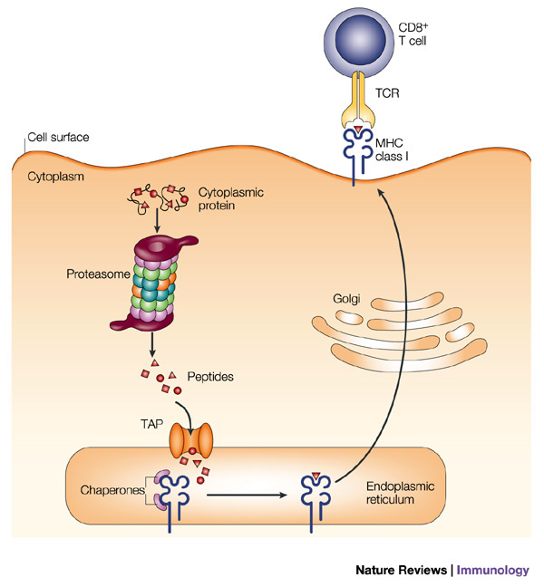
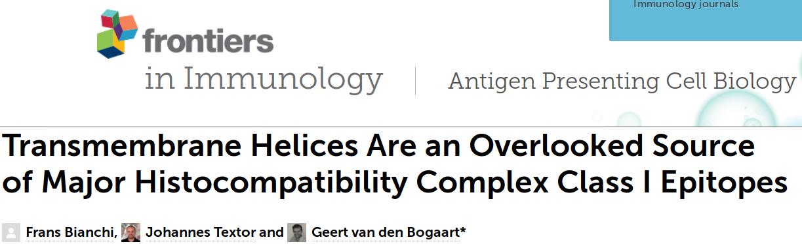
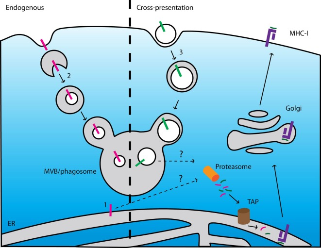
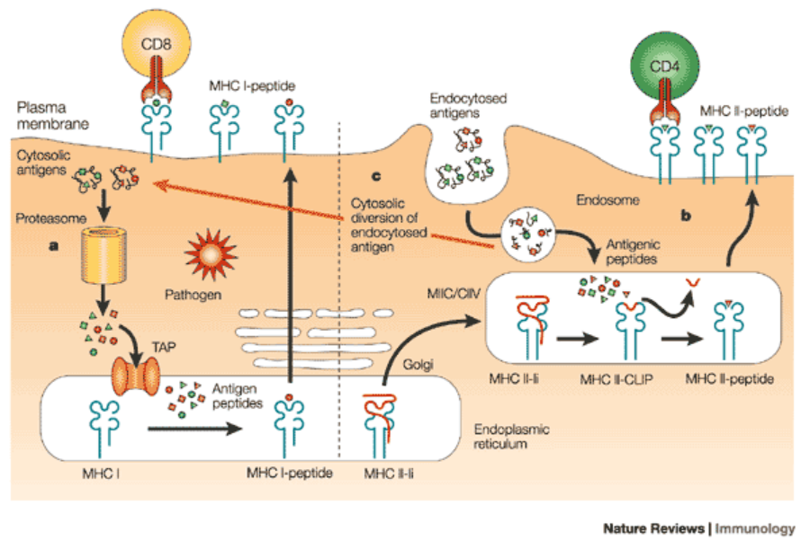
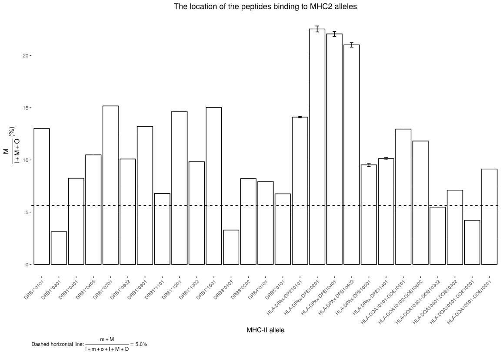
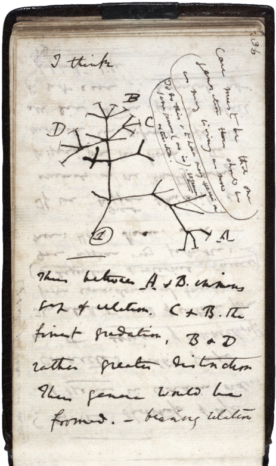
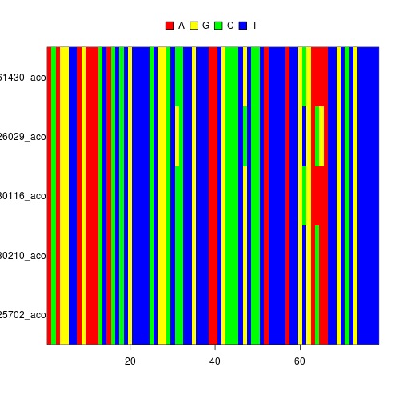
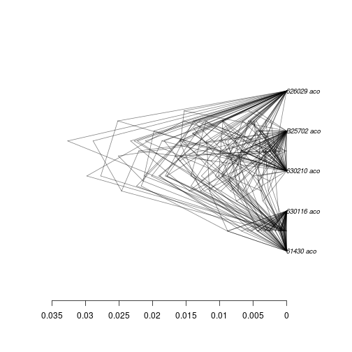
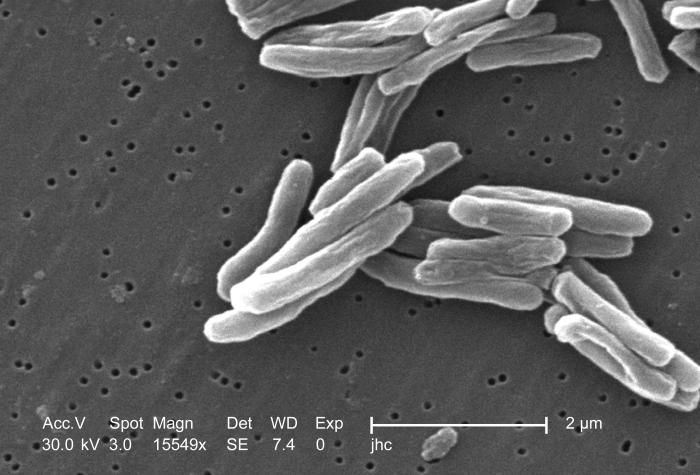

Transmembrane Helices Are Also An Overlooked Source Of MHC-II Epitopes
========================================================
author: Richèl J.C. Bilderbeek
date: 2019-06-04
autosize: true


<style>
.reveal h2 {
   font-size: 3.0em
}
.reveal h3 {
   font-size: 2.5em
}
.reveal li {
   font-size: 1.25em
}

.reveal table {
   margin-bottom: 1em;
   font-size: 1.25em
}

</style>

[https://github.com/richelbilderbeek/Science](https://github.com/richelbilderbeek/Science) 


========================================================


***


We know how it works
========================================================



Checking
========================================================

||
---|---|---
Bianchi|Textor|van den Bogaart

***

## Membrane proteins

 * Presented?
 * Detected?


Article
========================================================



(now referred to as [1])

Conclusion
========================================================



***

From [1]

Conclusion
========================================================


***

From [1]

And MHC-II?
========================================================



Method
========================================================


```r
library(tmhmm)
```

 * [https://github.com/richelbilderbeek/tmhmm](https://github.com/richelbilderbeek/tmhmm)


A. Krogh, B. Larsson, G. von Heijne, and E. L. L. Sonnhammer. Predicting transmembrane protein topology with a hidden Markov model: Application to complete genomes. Journal of Molecular Biology, 305(3):567-580, January 2001.

Method
========================================================


```r
library(netmhc2pan)
```

 * [https://github.com/richelbilderbeek/netmhc2pan](https://github.com/richelbilderbeek/netmhc2pan)


Improved methods for predicting peptide binding affinity to MHC class II molecules. Jensen KK, Andreatta M, Marcatili P, Buus S, Greenbaum JA, Yan Z, Sette A, Peters B, Nielsen M. Immunology. 2018 Jan 6. doi: 10.1111/imm.12889. PubMed: 29315598

Method
========================================================


```r
library(epitopeome)
```

 * [https://github.com/richelbilderbeek/epitopeome](https://github.com/richelbilderbeek/epitopeome)

Combines both!

Location|Binds strongly|Does not bind
-------|-------|----
Inside |I|i
TMH    |M|m
Outside|O|o

Method
========================================================


```r
library(bbbq)
```

 * [https://github.com/richelbilderbeek/bbbq](https://github.com/richelbilderbeek/bbbq)

Answers the bigger questions. Private until publication of the article.

Method
========================================================


```r
fasta_filename <- system.file("extdata", "tmhmm.fasta", package = "tmhmm")
cat(readLines(fasta_filename), sep = "\n")
```

```
>5H2A_CRIGR you can have comments after the ID
MEILCEDNTSLSSIPNSLMQVDGDSGLYRNDFNSRDANSSDASNWTIDGENRTNLSFEGYLPPTCLSILHL
QEKNWSALLTAVVIILTIAGNILVIMAVSLEKKLQNATNYFLMSLAIADMLLGFLVMPVSMLTILYGYRWP
LPSKLCAVWIYLDVLFSTASIMHLCAISLDRYVAIQNPIHHSRFNSRTKAFLKIIAVWTISVGVSMPIPVF
GLQDDSKVFKQGSCLLADDNFVLIGSFVAFFIPLTIMVITYFLTIKSLQKEATLCVSDLSTRAKLASFSFL
PQSSLSSEKLFQRSIHREPGSYTGRRTMQSISNEQKACKVLGIVFFLFVVMWCPFFITNIMAVICKESCNE
HVIGALLNVFVWIGYLSSAVNPLVYTLFNKTYRSAFSRYIQCQYKENRKPLQLILVNTIPALAYKSSQLQA
GQNKDSKEDAEPTDNDCSMVTLGKQQSEETCTDNINTVNEKVSCV
```

Method
========================================================


```r
all_alleles <- get_netmhc2pan_alleles()
my_allele <- all_alleles[1]
cat(my_allele)
```

```
DRB1_0101
```

```r
cat(length(all_alleles))
```

```
5631
```

```r
cat(head(all_alleles, n = 14))
```

```
DRB1_0101 DRB1_0102 DRB1_0103 DRB1_0104 DRB1_0105 DRB1_0106 DRB1_0107 DRB1_0108 DRB1_0109 DRB1_0110 DRB1_0111 DRB1_0112 DRB1_0113 DRB1_0114
```

Method
========================================================


```r
epitopeome <- create_epitopeome(fasta_filename, alleles = my_allele)
cat(epitopeome[1])
```

```
>5H2A_CRIGR
```

```r
cat(strsplit(gsub("([[:alnum:]]{70})", "\\1 ", epitopeome[2]), " ")[[1]])
```

```
oooooooooooooooooooooooooooooooooooooooooooooooooooooooooooooooooooooo oooooommmmmmmmmmmmmmmmmmmmmmmiiiiiiiIIIIIMMMMMMMMMMMMMMMMMMMMMMMOOOOoo oooooooommmmmmmmmmmmmmmmmmmmMMMIIIIIIIIIIIIIIIIiiiimmmmmmmmmmmmmmmmmmm mmmmooooooooooooooooooommmmmmmmmmmmmmmMMMMMMMMIIIIIIIIIIIIiiiiiiiIIIII IIIIIIIIIIIIIIIIiiiiiiiiiiiiiiiiiiiiiiiiiiiimmmmmmmmmmmmmmmmmmmmmmmooo oooooommmmmmmMMMMMMMMMMMMMMMMIIIIIIIIIIIIIIIIIIIIIiiIIIIIIIIIIIIIIIIII IIiiiiiiiiiiiiiiiiiiiiiiiiiiiiiiiiiiiiiiiiiiiiiiiii
```

Method
========================================================


```r
knitr::kable(answer_bbbq_1(fasta_filename, alleles = my_allele))
```


|epitopium |   n|
|:---------|---:|
|i         |  97|
|m         | 111|
|o         | 114|
|I         |  95|
|M         |  50|
|O         |   4|

========================================================



Future
========================================================



***

# Are pathogen TMHs evolutionary conserved?

Method
========================================================


```r
library(babette)
```

Bilderbeek, Richèl JC, and Rampal S. Etienne. "babette: BEAUti 2, BEAST 2 and Tracer for R." Methods in Ecology and Evolution (2018). https://doi.org/10.1111/2041-210X.13032


***

|
---|---
Bilderbeek|Etienne

Method
========================================================


```r
fasta_file <- get_babette_path("anthus_aco_sub.fas")
image(ape::read.FASTA(fasta_file))
```



Method
========================================================


```r
plot_densitree(bbt_run(
    fasta_file, mcmc = create_mcmc(chain_length = 100000)
  )$anthus_aco_sub_trees[50:100], alpha = 0.5)
```



Method
========================================================

 * Pathogen: *Mycobacterium tuberculosis*
 * Estimating mutation rates of TMH and non-TMH part
 * Per protein:

Ptn|Sequence
---|------------------------------------
MT |`MEILCEDNTSLSSIPNSLMQVD`
loc|`iiimmmmmmmmmmmmmmmoooo`
SP1|`.X................X...`
SP2|`........X.............`
SP3|`..X.................X.`

***



Conclusion
========================================================

 * TMHs are also an overlooked source of MHC-II epitopes
 * Evolutionary conservation of TMHs yet unknown

Questions?
========================================================
